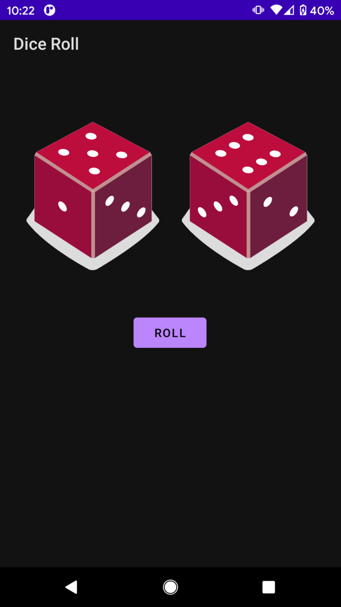

# Dice Roll

Kotlin dice roll app from developers.google.com "badge". This is also used in the Udacity Android Developer nanodegree. It is a simple example, but it does demonstrate how easy Kotlin makes app development compared to Java.

